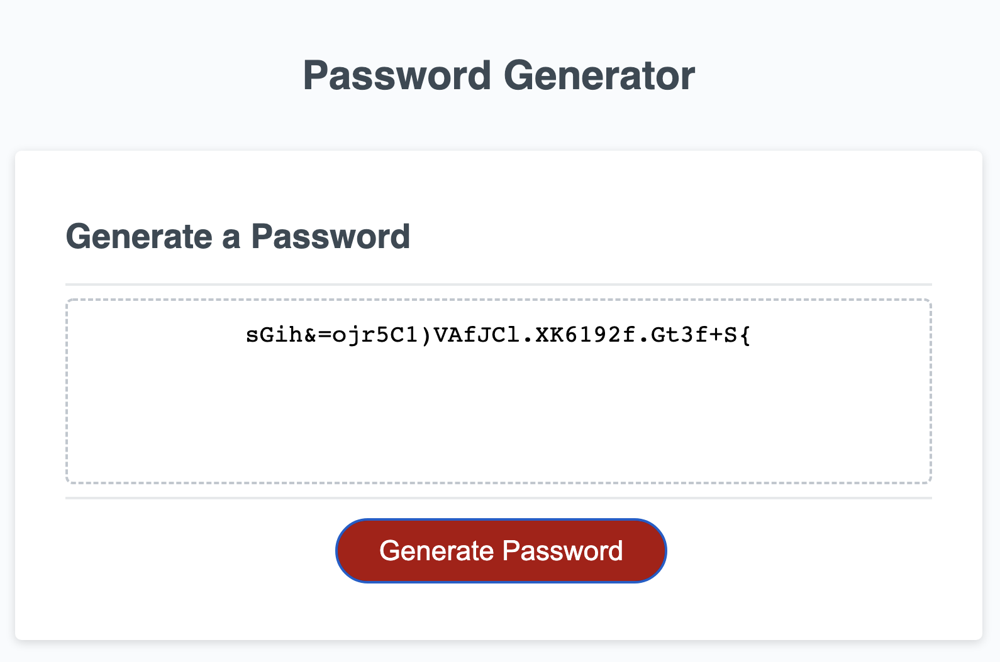

# module-3-pass-generator

##Purpose
This project required developing working Javascript code to provide functionality to a password generator webpage. The client requested a webpage that would generate random passwords for employees after responding to their user selections for different criteria. The html and css remain relatively untouched.

##Coding Process and Obstacles
Working backwards, I made sure that the page could generate a password that responded to prompt criteria from user. Repeated use of "console.log" allowed me to continously check my work (most console.log items have since been removed from my code). Once the password generator produced a password with character length corresponding to prompt response, I began creating arrays that, when accessed in conjunction with Math.floor and Math.random functions, would choose successive characters to add to an intially empty string that would, upon reaching the desired password length, become the password.

One major obstacle was creating the logic to connect the user responses for character types with the corresponding functions that would generate random charcters of each type. I ultimately acheived this by placing user responses in an array, placing the functions in an array, and then referencing the user response array to create a new array, "ActiveArray," containing only the random character generator functions that had been selected for use by the prompt responses.

Another challenge was building in corrective alerts that redirect users who input unparseable responses to the prompts. In itself this was not a challenge, but for reasons still unclear to me, certain faulty response patterns would send the webpage into a loop of prompts and alerts which would resolve itself with incorrect data stored in the user response variables. However, at the suggestion of TA Marisa, I ultimately changed the script to use "return null" to clear the bad user response, instead of restarting the main function "writePassword()".

##Credits
This project's code took inspiration from a resource found on the web, namely Tutorials Tonight's [Javascript password generator](https://www.tutorialstonight.com/password-generator-in-javascript). However, because their project uses in-page surveys as opposed to prompt/alert features, much of their code was unusable. The piece I directly borrowed is the constant declaration for the character collections from which the random character functions would choose characters. I also took motivation from their "keyToAdd" and "isChecked" elements, creating similar functions "keyToAdd" and "funChooser". TA Marisa helped me resolve an issue of unpredictable prompts and alerts when the page was provided unusable inputs by suggesting the "return null" lines of code following the corrective alerts for bad responses.

Here is a screenshot:

I hope you appreciate this password generator, you can try it for yourself at [the deployed GitHub webpage](https://briancampbell003.github.io/module-########)

